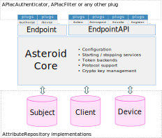

# Design and general architecture

## Design principles

Asteroid is an opinionated piece of software. Its key principles are:
- Enable a high level of configurability
- Allow customization anywhere where it could be needed
- Scale vertically as much as possible, and only then horizontally
- Full implementation of the specifications (no half-completed implementations)
- Implementation of a simple model for business data (users, applications, devices...) based
on SCIM

It's written on top of the Erlang Virtual Machine (EVM) and therefore benefits from its key
feature when it comes to servers:
- fault-tolerance
- high performance
- performance predictability

Elixir brings a clear and concise syntax, making the code more maintainable and less prone to
errors.

## Architecture

Asteroid relies on the following components and configuration:
- Asteroid core services that support OAuth2 protocol and all other related services
- Two endpoints - one for the web, the other one for the APIs
(see [Network configuration](network-configuration.html))
- Each API can be configured by a unique set of plugs
(see also [Protecting APIs](protecting-apis.html)):
  - [`APIac.Authenticator`](https://github.com/tanguilp/apiac/blob/master/lib/apiac/authenticator.ex) implementation, such as:
    - [APIacBasicAuth](https://github.com/tanguilp/apiac_auth_basic)
    - [APIacAuthBearer](https://github.com/tanguilp/apiac_auth_bearer)
    - [APIacClientSecretPostAuth](https://github.com/tanguilp/apiac_auth_client_secret_post)
    - [APIacAuthMTLS](https://github.com/tanguilp/apiac_auth_mtls)
  - [`APIac.Filter`](https://github.com/tanguilp/apiac/blob/master/lib/apiac/filter.ex) implementation, such as:
    - [APIacFilterIPWhitelist](https://github.com/tanguilp/apiac_filter_ip_whitelist)
    - [APIacFilterIPBlacklist](https://github.com/tanguilp/apiac_filter_ip_blacklist)
    - [APIacFilterThrottler](https://github.com/tanguilp/apiac_filter_throttler)
  - any other module implementing the `Plug` behaviour, such as CORS filters, CSRF module, etc.
- Identity repositories implementing some behaviours of the
[AttributeRepository](https://github.com/tanguilp/attribute_repository) library
see also Attribute repositories. Asteroid comes with 3
preconfigured repositories:
  - `Asteroid.Subject` to store user identities
  - `Asteroid.Client` to store application information
  - `Asteroid.Device` to store data on devices (smartphone, IoTs...). This repository is unused
  by Asteroid because OAuth2 protocols don't require it, but it's made available for OAuth2
  extension that would need it
  - other attribute repositories can easily be added, using one of the existing implementations:
    - [AttributeRepositoryMnesia](https://github.com/tanguilp/attribute_repository_mnesia): the
    built-in in-memory or disc-based (or both) EVM database. Guarantees very fast access and
    suitable for low to medium number of objects
    - [AttributeRepositoryRiak](https://github.com/tanguilp/attribute_repository_riak): based
    on the scalable distributed eventually-consistent Riak datastore, for large deployments
    - [AttributeRepositoryLdap](https://github.com/tanguilp/attribute_repository_ldap): read-only
    access to LDAP databse, for integration in existing architectures
