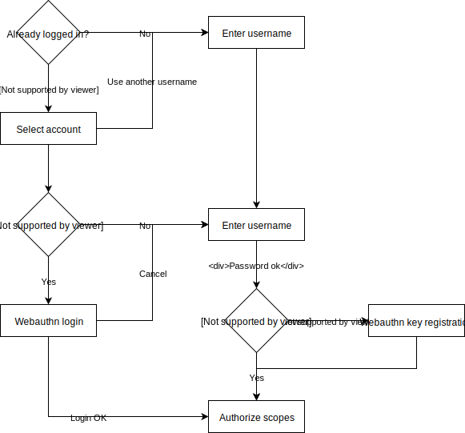
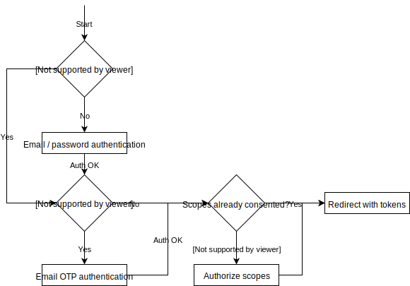
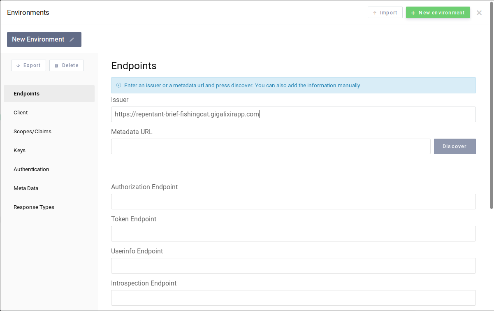
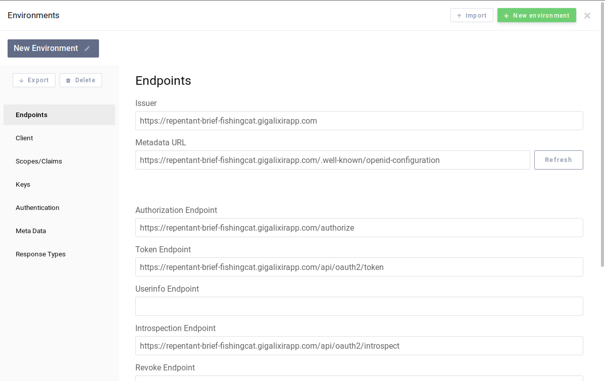
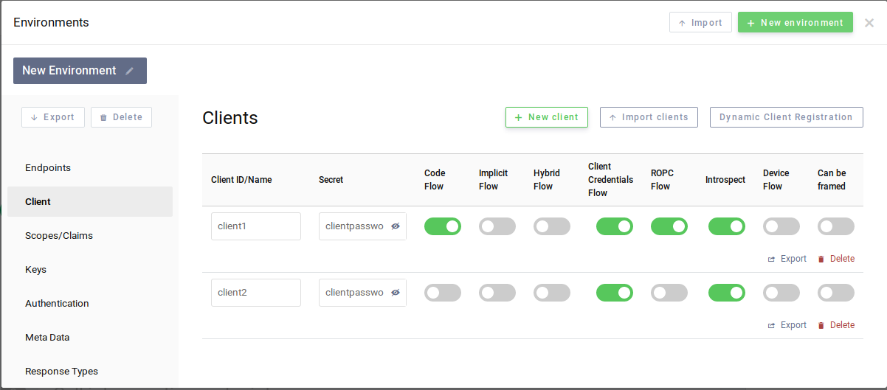
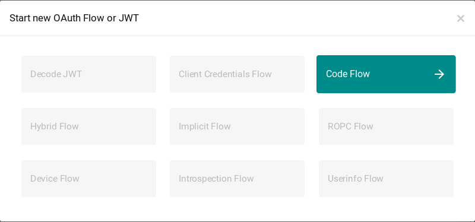
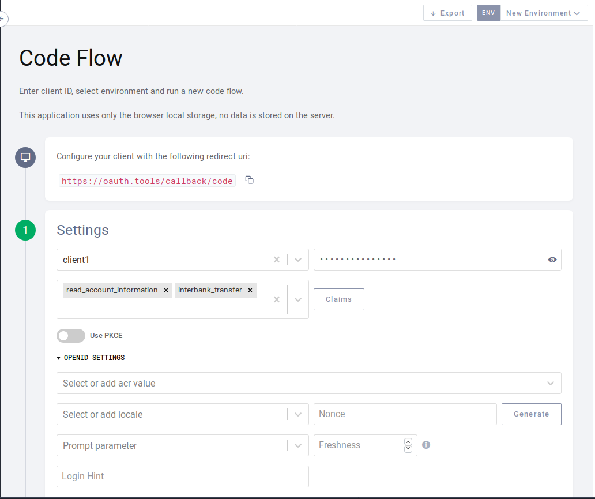
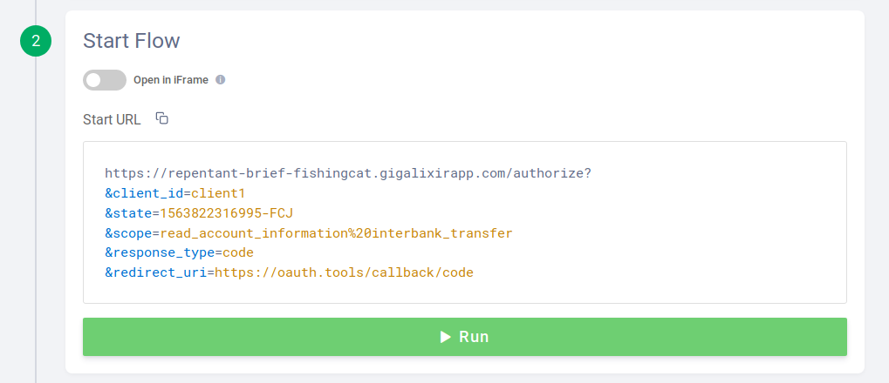
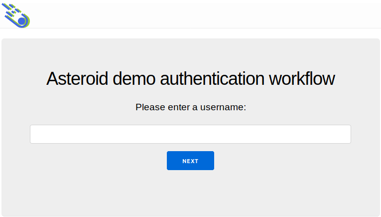

# Running the demo app

A demo application is made available on the `demo_auth_workflow` branch.

This demo application implements an authentication and authorization workflow for
the authorization code flow and enables the ROPC and client credentials flows.

## Authentication workflow

Two authentication workflows are implemented:
- one for OAuth2
- one for OpenID Connect

### OAuth2 demo

The following flow is in action:



Note that the usernames are stored in the browser's local storage. If Asteroid and the browser
become inconsistent, one might want to reset the local storage for the demo app URL.

In this example, the scope consent page is always shown.

### OpenID Connect demo

Thw following flow is in action:



It uses 2 authentication events: one for password authentication, another for OTP authentication.

The password authentication event lasts 10 minutes, and the OTP authentication event lasts 1
minute. These values are choosen for demonstration purpose.

The OTP is sent by email. On the `demo_auth_workflow` branch, the OTP is sent locally and
one can access the Bamboo debugging interface on
[http://localhost:4000/sent_emails/](http://localhost:4000/sent_emails/). On the
`demo_auth_workflow_gigalixir`, an external email delivery service is used.

In this example, the scope consent page is not shown if the scopes were already approved.

## Preconfigured clients and subjects

The following resources are preconfigured:
- clients:
  - `"client1"` with the associated password `"clientpassword1"`
    - Enabled grant types: `"password"`, `"client_credentials"`, `"authorization_code"`,
    `"refresh_token"`, `"implicit"`
    - Enabled repsonse types: `"code"`, `"token"`, `"id_token"`, `"id_token token"`,
    `"code id_token"`, `"code token"`, `"code id_token token"`
    - Access token serialization format: opaque
  - `"client2"` with the associated password `"clientpassword2"`
    - Enabled grant types: `"client_credentials"`
    - Enabled response types: none
    - Access token serialization format: JWS
- subjects:
  - `"user_demo"` with the password field set to `"asteroidftw"`

Note that introspection is set for both clients.

## Run locally

First check out to the `demo_auth_workflow` branch. Then retrieve the dependencies (this includes
the Wax Webauthn library) and finally run the server:

```bash
git checkout demo_auth_workflow

mix deps.get

iex -S mix phx.server
```

### URL and curl commands

#### OAuth2

URLs to trigger the workflow (with `http://localhost:4000`):
- [http://localhost:4000/authorize?response_type=code&client_id=client1&redirect_uri=http%3A%2F%2Fwww.example.com%2Foauth2_redirect](http://localhost:4000/authorize?response_type=code&client_id=client1&redirect_uri=http%3A%2F%2Fwww.example.com%2Foauth2_redirect)
(no scopes requested)
- [http://localhost:4000/authorize?response_type=code&client_id=client1&redirect_uri=http%3A%2F%2Fwww.example.com%2Foauth2_redirect&scope=read_balance](http://localhost:4000/authorize?response_type=code&client_id=client1&redirect_uri=http%3A%2F%2Fwww.example.com%2Foauth2_redirect&scope=read_balance)
(only the `"read_balance"` scope is requested)
- [http://localhost:4000/authorize?response_type=code&client_id=client1&redirect_uri=http%3A%2F%2Fwww.example.com%2Foauth2_redirect&scope=interbank_transfer%20read_account_information%20read_balance](http://localhost:4000/authorize?response_type=code&client_id=client1&redirect_uri=http%3A%2F%2Fwww.example.com%2Foauth2_redirect&scope=interbank_transfer%20read_account_information%20read_balance)
(all 3 configured scopes are requested)

Curl commands:

```bash
curl -u client1:clientpassword1 -d "grant_type=password&username=user_demo&password=asteroidftw" http://localhost:4001/api/oauth2/token | jq

curl -u client1:clientpassword1 -d "grant_type=client_credentials" http://localhost:4001/api/oauth2/token | jq

curl -u client2:clientpassword2 -d "grant_type=client_credentials" http://localhost:4001/api/oauth2/token | jq
```

#### OpenID Connect

Some URLs to trigger the workflow:
- [http://localhost:4000/authorize?response_type=id_token&client_id=client1&redirect_uri=http%3A%2F%2Fwww.example.com%2Foauth2_redirect&scope=openid%20email&nonce=exgsx](http://localhost:4000/authorize?response_type=id_token&client_id=client1&redirect_uri=http%3A%2F%2Fwww.example.com%2Foauth2_redirect&scope=openid%20email&nonce=exgsx)
- [http://localhost:4000/authorize?response_type=id_token&client_id=client1&redirect_uri=http%3A%2F%2Fwww.example.com%2Foauth2_redirect&scope=openid%20email%20read_balance&nonce=exgsx](http://localhost:4000/authorize?response_type=id_token&client_id=client1&redirect_uri=http%3A%2F%2Fwww.example.com%2Foauth2_redirect&scope=openid%20email%20read_balance&nonce=exgsx)
- [http://localhost:4000/authorize?response_type=id_token&client_id=client1&redirect_uri=http%3A%2F%2Fwww.example.com%2Foauth2_redirect&scope=openid%20email&nonce=exgsx&prompt=login](http://localhost:4000/authorize?response_type=id_token&client_id=client1&redirect_uri=http%3A%2F%2Fwww.example.com%2Foauth2_redirect&scope=openid%20email&nonce=exgsx&prompt=login)
- [http://localhost:4000/authorize?response_type=id_token&client_id=client1&redirect_uri=http%3A%2F%2Fwww.example.com%2Foauth2_redirect&scope=openid%20email&nonce=exgsx&max_age=1](http://localhost:4000/authorize?response_type=id_token&client_id=client1&redirect_uri=http%3A%2F%2Fwww.example.com%2Foauth2_redirect&scope=openid%20email&nonce=exgsx&max_age=1)
- [http://localhost:4000/authorize?response_type=id_token&client_id=client1&redirect_uri=http%3A%2F%2Fwww.example.com%2Foauth2_redirect&scope=openid%20email&nonce=exgsx&acr_values=1-factor](http://localhost:4000/authorize?response_type=id_token&client_id=client1&redirect_uri=http%3A%2F%2Fwww.example.com%2Foauth2_redirect&scope=openid%20email&nonce=exgsx&acr_values=1-factor)
- [http://localhost:4000/authorize?response_type=id_token&client_id=client1&redirect_uri=http%3A%2F%2Fwww.example.com%2Foauth2_redirect&scope=openid%20email&nonce=exgsx&acr_values=2-factor](http://localhost:4000/authorize?response_type=id_token&client_id=client1&redirect_uri=http%3A%2F%2Fwww.example.com%2Foauth2_redirect&scope=openid%20email&nonce=exgsx&acr_values=2-factor)
- [http://localhost:4000/authorize?response_type=id_token&client_id=client1&redirect_uri=http%3A%2F%2Fwww.example.com%2Foauth2_redirect&scope=openid%20email&nonce=exgsx&claims=%20%20%7B%0A%20%20%20%22id_token%22%3A%0A%20%20%20%20%7B%0A%20%20%20%20%20%22acr%22%3A%20%7B%22essential%22%3A%20true%7D%0A%20%20%20%20%7D%0A%20%20%7D](http://localhost:4000/authorize?response_type=id_token&client_id=client1&redirect_uri=http%3A%2F%2Fwww.example.com%2Foauth2_redirect&scope=openid%20email&nonce=exgsx&claims=%20%20%7B%0A%20%20%20%22id_token%22%3A%0A%20%20%20%20%7B%0A%20%20%20%20%20%22acr%22%3A%20%7B%22essential%22%3A%20true%7D%0A%20%20%20%20%7D%0A%20%20%7D)

## Run on Gigalixir

After setting up your Gigalixir account, checkout to the `demo_auth_workflow_gigalixir` branch
and push it to Gigalixir:

```bash
$ git checkout demo_auth_workflow_gigalixir

$ git push gigalixir demo_auth_workflow_gigalixir:master
```

After a few minutes, the application is deployed and can be accessed.

## Testing with oauth.tools

[oauth.tools](https://oauth.tools/) is a website that allows testing different OAuth2 and
OpenID Connect flows.

**Beware**, OAuth2 parameters route through their servers, including application and user
passwords. **Don't user it with real world applications**.

It is however very convenient for testing. For instance, after deploying the application
on Gigalixir, go through the following steps to test the demo.

First, open the site and clic "Environments". A configuration window shows up, enter the
issuer (which happens to be the base URL):



and then clic on "Discover". The OAuth2 parameters are automatically loaded:



It remains to configure the clients, as shown here:



Then go back to the main page (no need to save) and clic on "+ Start flow", then on
"Authorization code":



Select `"client1"` as the test client, select the scopes (or none) and activate PKCE if you
wish:



Then clic on "Run" at the bottom:



You should be redirected to the web authentication workflow of the demo application:


