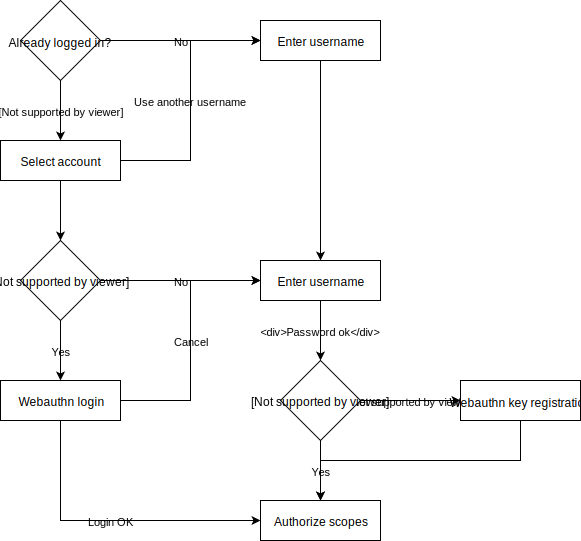

# Running the demo app

A demo application is made available on the `demo_auth_workflow` branch.

This demo application implements an authentication and authorization workflow for
the authorization code flow and enables the ROPC and client credentials flows.

## Authentication workflow



Note that the usernames are stored in the browser's local storage. If Asteroid and the browser
become inconsistent, one might want to reset the local storage for the demo app URL.

## Preconfigured clients and subjects

The following resources are preconfigured:
- clients:
  - `"client1"` with the associated password `"clientpassword1"`
    - Enabled grant types: `"password"`, `"client_credentials"`, `"authorization_code"`,
    `"refresh_token"`
    - Access token serialization format: opaque
  - `"client2"` with the associated password `"clientpassword2"`
    - Enabled grant types: `"client_credentials"`
    - Access token serialization format: JWS
- subjects:
  - `"user_demo"` with the password field set to `"asteroidftw"`

## How to run locally

First check out to the `demo_auth_workflow` branch. Then retrieve the dependencies (this includes
the Wax Webauthn library) and finally run the server:

```bash
git checkout demo_auth_workflow

mix deps.get

iex -S mix phx.server
```

## URL and curl commands

URLs to trigger the workflow (with `http://localhost:4000`):
- [http://localhost:4000/authorize?response_type=code&client_id=client1&redirect_uri=http%3A%2F%2Fwww.example.com%2Foauth2_redirect](http://localhost:4000/authorize?response_type=code&client_id=client1&redirect_uri=http%3A%2F%2Fwww.example.com%2Foauth2_redirect)
(no scopes requested)
- [http://localhost:4000/authorize?response_type=code&client_id=client1&redirect_uri=http%3A%2F%2Fwww.example.com%2Foauth2_redirect&scope=read_balance](http://localhost:4000/authorize?response_type=code&client_id=client1&redirect_uri=http%3A%2F%2Fwww.example.com%2Foauth2_redirect&scope=read_balance)
(only the `"read_balance"` scope is requested)
- [http://localhost:4000/authorize?response_type=code&client_id=client1&redirect_uri=http%3A%2F%2Fwww.example.com%2Foauth2_redirect&scope=interbank_transfer%20read_account_information%20read_balance](http://localhost:4000/authorize?response_type=code&client_id=client1&redirect_uri=http%3A%2F%2Fwww.example.com%2Foauth2_redirect&scope=interbank_transfer%20read_account_information%20read_balance)
(all 3 configured scopes are requested)

Curl commands:

```bash
curl -u client1:clientpassword1 -d "grant_type=password&username=user_demo&password=asteroidftw" http://localhost:4001/api/oauth2/token | jq

curl -u client1:clientpassword1 -d "grant_type=client_credentials" http://localhost:4001/api/oauth2/token | jq

curl -u client2:clientpassword2 -d "grant_type=client_credentials" http://localhost:4001/api/oauth2/token | jq
```
